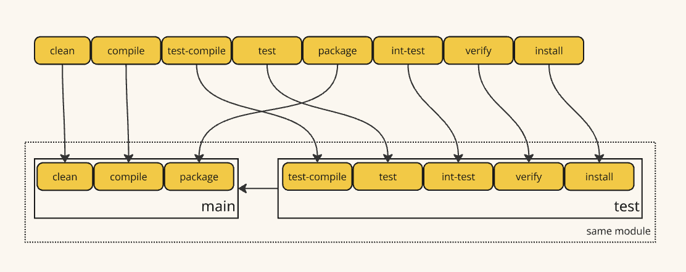
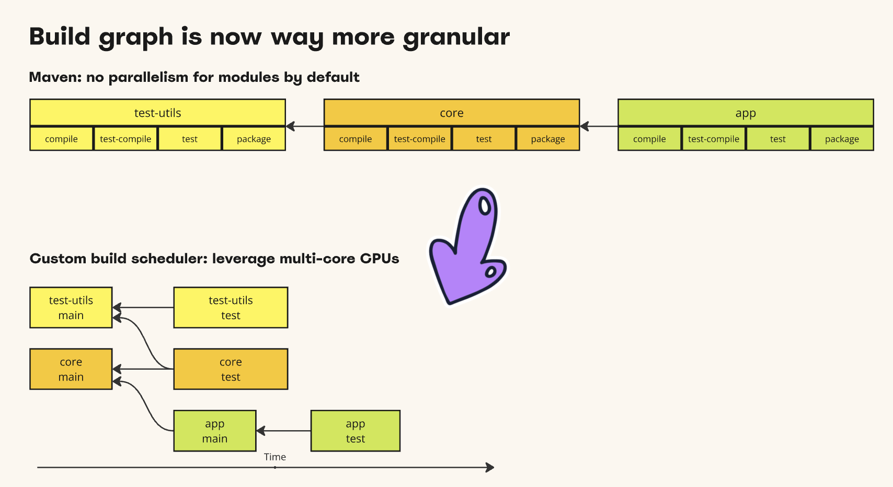

# Maven Half-Life builder
## Problem statement
By default, to build any module in a multi-module project Maven first resolves and executes all phases of upstream
dependencies. This is a fundamental behaviour which is built-in and strongly enforced because of back compatibility.
This significantly reduces possible concurrency and in a multi-core system CPU cores are loaded unevenly.

## Proposed solution
It's a custom implementation of Maven builder that schedules modules build in an efficient way.
The fundamental idea behind this implementation is to split the module build lifecycle to two parts (halves),
let's call them "main" and "test".
* The "main" part is the compilation and packaging of `src/main` source code which may be a dependency from the other module
* The "test" part always depends on "main" and includes compilation and execution of tests (surefire and failsafe), 
verify and install

The build phases of the module are separated like this (some intermediate phases are ommitted to simplify explanation):




The major outcome of this approach is better utilization of multi-core CPUs by multi-module projects. The advantage can be more than 35% in boost.

## How to setup extension:
First, you need to build it locally as there are no public releases so far:
```shell
./mvnw clean install
```

Configure your project `.mvn/extensions.xml`
```xml
<extensions>
    <extension>
        <groupId>com.github.seregamorph</groupId>
        <artifactId>maven-half-life-builder</artifactId>
        <version>0.1-SNAPSHOT</version>
    </extension>
</extensions>
```
and specify custom builder on the command line to enable it, also specify the number of workers:
```shell
mvn clean install -bhalf-life -T1C
```
